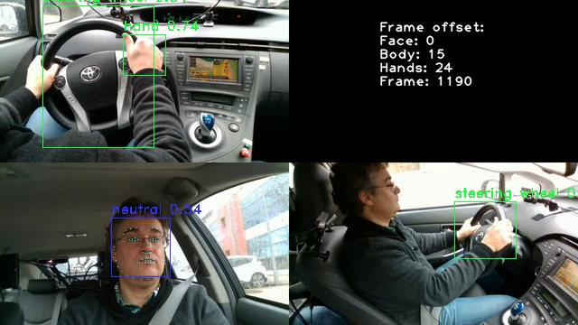

# ACT Driving Simulator Computer Vision #


This project takes in driving simulator videos and produces datapoints such as:
* Facial features (using the face-recognition library: https://github.com/ageitgey/face_recognition)
* Emotion detection (using the facial expression recognition library: https://github.com/justinshenk/fer)
* Hands and steering wheel detection (custom YOLO model trained - see [YOLO training readme](YOLO_README.md)). 
 Pytorch weights from Spring 2021 are located at yolo/results/train/stock_image_train/weights/best.pt

## Datasets ##
**DMD Dataset:**
https://dmd.vicomtech.org/    
Ortega, J., Kose, N., Cañas, P., Chao, M.a., Unnervik, A., Nieto, M., Otaegui, O., & Salgado, L. (2020). DMD: A Large-Scale Multi-Modal Driver Monitoring Dataset for Attention and Alertness Analysis. In Proceedings of the European Conference on Computer Vision (ECCV) Workshops (Accepted).

**Other datasets:**  
See the imagesets directory: 
* act_simulator
* stock (google search results)

## Setup ##
Project tested using Python 3.8.5  
Install the following pip/conda packages:
* dlib
* cmake

Check out the Yolo project and install their requirements.txt first:  
https://github.com/ultralytics/yolov5.git

Install the requirements.txt from this repo:  
```pip install -r requirements.txt```

If you are using Anaconda and there's a complaint about "version `GLIBCXX_3.4.29' not found", then run  
```conda install -c conda-forge gxx_linux-64==11.1.0```

## Running detections ##
Create a test directory for the script outputs.  

There is a one minute sample video (DMD_trimmed.mov) from DMD data used for testing the script. 
   
```python run_models.py DMD_trimmed.mov -v``` 

```
python run_models.py -h

usage: run_models.py [-h] [-s PROCESS_SECONDS] [-v] video

Run a driving simulator video through various models.

positional arguments:
  video                 input video to process

optional arguments:
  -h, --help            show this help message and exit
  -s PROCESS_SECONDS, --process_seconds PROCESS_SECONDS
                        process a frame every X seconds
  -v, --verbose         prints extra information and writes test images


```
  

This script runs through a video file and for every second (configurable), it will take a frame and run the image through all the models.  
This will produce test images like the one in the readme with annotations from the models.  It will also print out more detailed information per frame, such as:  
```
video position: 50 seconds
Facial detection: 1 face(s)
Face 1:
chin: [(219, 538), (216, 552), (217, 568), (221, 583), (226, 598), (233, 611), (243, 621), (257, 629), (271, 632), (288, 629), (305, 623), (321, 615), (334, 604), (342, 589), (346, 573), (349, 555), (350, 537)]
left_eyebrow: [(231, 518), (236, 508), (244, 502), (255, 501), (264, 505)]
right_eyebrow: [(285, 502), (296, 497), (309, 497), (320, 502), (327, 512)]
nose_bridge: [(274, 525), (273, 532), (271, 540), (269, 547)]
nose_tip: [(259, 563), (265, 565), (271, 566), (278, 563), (286, 561)]
left_eye: [(243, 532), (248, 527), (254, 526), (262, 531), (255, 532), (248, 533)]
right_eye: [(292, 528), (299, 523), (306, 523), (312, 526), (306, 529), (299, 529)]
top_lip: [(249, 587), (258, 581), (266, 577), (271, 578), (277, 577), (286, 579), (298, 584), (294, 584), (277, 583), (271, 584), (266, 584), (252, 586)]
bottom_lip: [(298, 584), (287, 591), (278, 593), (272, 595), (266, 595), (258, 593), (249, 587), (252, 586), (267, 587), (272, 587), (278, 586), (294, 584)]

Emotion detection: 1 face(s)
Primary result: sad 0.35
Location: (814, 367, 114, 114)
{'angry': 0.06, 'disgust': 0.0, 'fear': 0.08, 'happy': 0.1, 'sad': 0.35, 'surprise': 0.07, 'neutral': 0.33}
```

